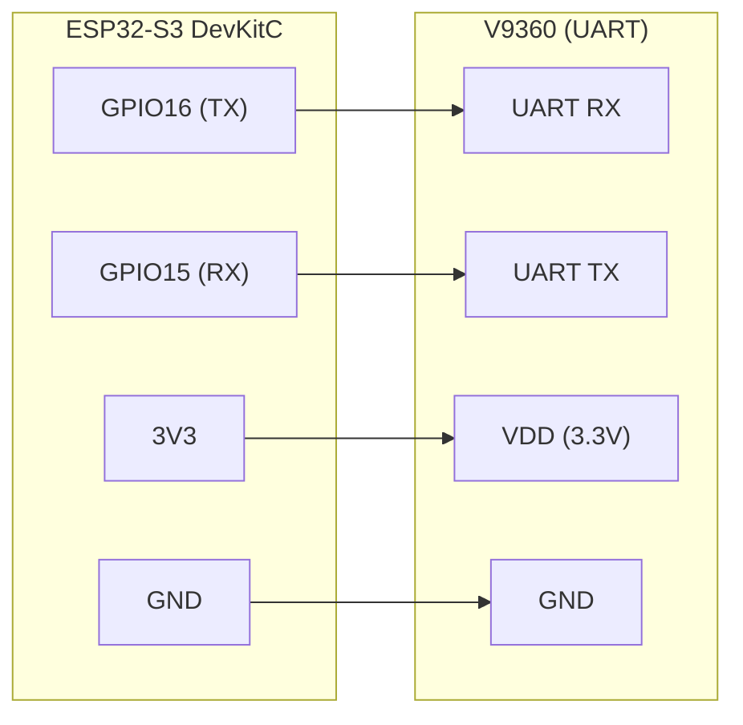
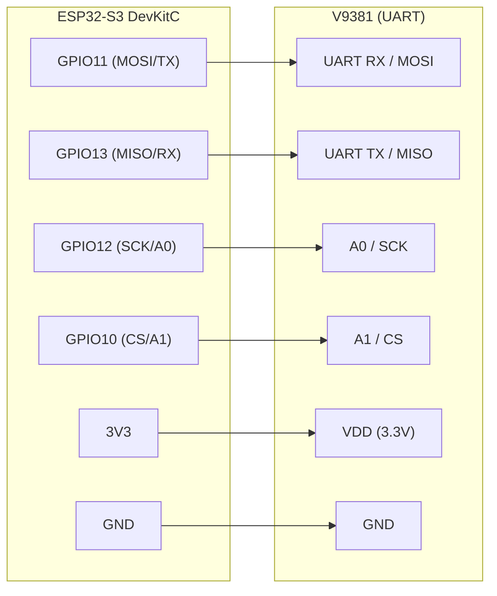
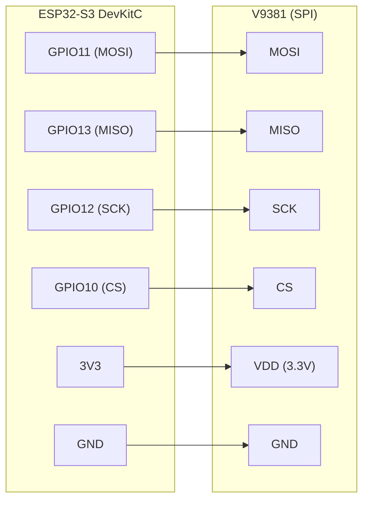

# Getting Started with V93XX Arduino Libraries

Quick start guide to get you testing V9381 UART communication in under 5 minutes.

## ⚡ Installation

### 1. Clone the Library
```bash
cd ~/Arduino/libraries
git clone https://github.com/whatnick/V93XX_Arduino.git
```

### 2. Verify Installation
Open Arduino IDE → Sketch → Include Library → Should see "V93XX_Arduino"

## 📦 First Program

Create a new sketch:

```cpp
#include "V93XX_UART.h"

V93XX_UART v9381;

void setup() {
  Serial.begin(115200);
  
  // Initialize with Dirty mode (default - shows CRC but continues)
  v9381.Init();
  
  Serial.println("V9381 initialized");
}

void loop() {
  // Read register at address 0x00
  uint32_t value = v9381.RegisterRead(0x00);
  
  Serial.print("Register 0x00 = 0x");
  Serial.println(value, HEX);
  
  delay(1000);
}
```

## 🌊 Waveform Capture Example

Capture and analyze waveform data:

```cpp
#include "V93XX_UART.h"

V93XX_UART v9381;
uint32_t waveform[512];

void setup() {
  Serial.begin(115200);
  v9381.Init();  // Dirty mode for capture robustness
}

void loop() {
  // Configure: 512 samples, Channel A voltage, manual trigger
  uint32_t ctrl5 = (1 << 18) | (2 << 9) | (0 << 6);
  
  if (v9381.CaptureWaveform(waveform, 512, ctrl5, 2000, 4)) {
    Serial.println("Waveform captured!");
    // Print first 10 samples
    for (int i = 0; i < 10; i++) {
      Serial.printf("Sample %d: 0x%08X\n", i, waveform[i]);
    }
  }
  delay(2000);
}
```

## 🔗 Hardware Wiring (ESP32-S3 DevKitC Defaults)

These are the pin defaults used by the examples. You can remap pins in your sketch if needed.

### V9360 (UART)



### V9381 (UART)



### V9381 (SPI)



## ▶️ Upload & Monitor

1. **Select Board**: Tools → Board → ESP32-S3
2. **Select Port**: Tools → Port → COM3 (or your port)
3. **Upload**: Sketch → Upload
4. **Monitor**: Tools → Serial Monitor (115200 baud)

Expected output:
```
Initializing V9381 UART...
Checksum Mode set to Dirty (skip CRC validation)
Testing with Dirty Mode...
CRC Valid: Expected 0x2B, Received 0x2B
Register 0x00 = 0x12345678
```

## 🧪 Run Tests

### Quick Unit Tests (No Hardware)
```bash
python docs/../tools/test_checksum_mode.py
# Output: ✅ All tests passed!
```

### Full Hardware Test (~40 seconds)
```bash
.\tools\run_automated_tests.ps1 -Port COM3 -SkipCapture
# Output: ✅ OVERALL: PASSED
```

### With Logic Analyzer Capture (~80 seconds)
```bash
.\tools\run_automated_tests.ps1 -Port COM3
# Output: ✅ OVERALL: PASSED (includes CRC analysis)
```

## 🎯 Next Steps

### For Debugging
- See [UART_CHECKSUM_MODE.md](UART_CHECKSUM_MODE.md#debugging-workflow) if you see CRC mismatches

### For Integration
- See [INTEGRATION.md](INTEGRATION.md) for production mode setup

### For Automation
- See [COPILOT.md](COPILOT.md) to use with GitHub Copilot

### For Details
- See [API_REFERENCE.md](API_REFERENCE.md) for all methods

## ❓ Common Issues

| Issue | Solution |
|-------|----------|
| "Board not found" | Check USB cable, restart Arduino IDE |
| "Serial monitor shows garbage" | Check baud rate is 115200 |
| "CRC Mismatch messages" | Normal in Dirty mode - use Dirty mode for debugging |
| "Device not responding" | Check GPIO connections (1=TX, 2=RX) |

## 📚 Examples

| File | Purpose |
|------|---------|
| `examples/V9381_UART_DIRTY_MODE/` | Dirty mode demonstration |
| `examples/V9381_UART/` | Basic UART communication |
| `examples/V9381_SPI/` | SPI communication (if using SPI) |

---

✅ Ready to test? Upload the sketch above and check the Serial Monitor!

For comprehensive documentation, see [README.md](README.md).
