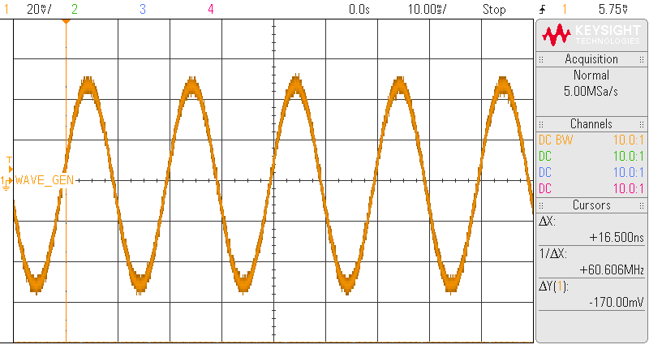
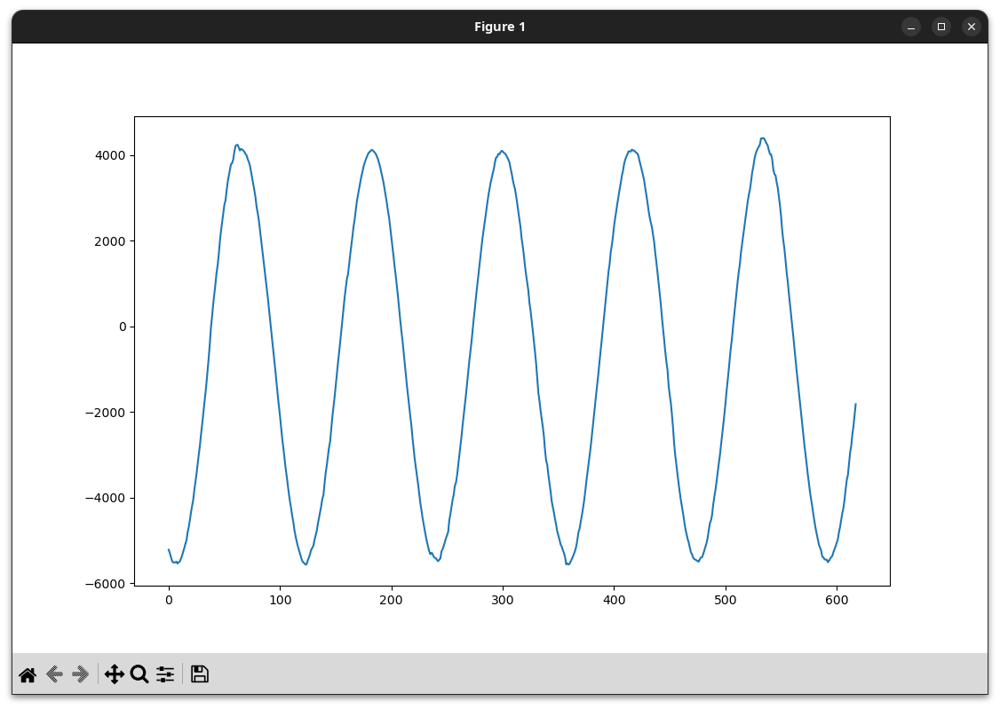
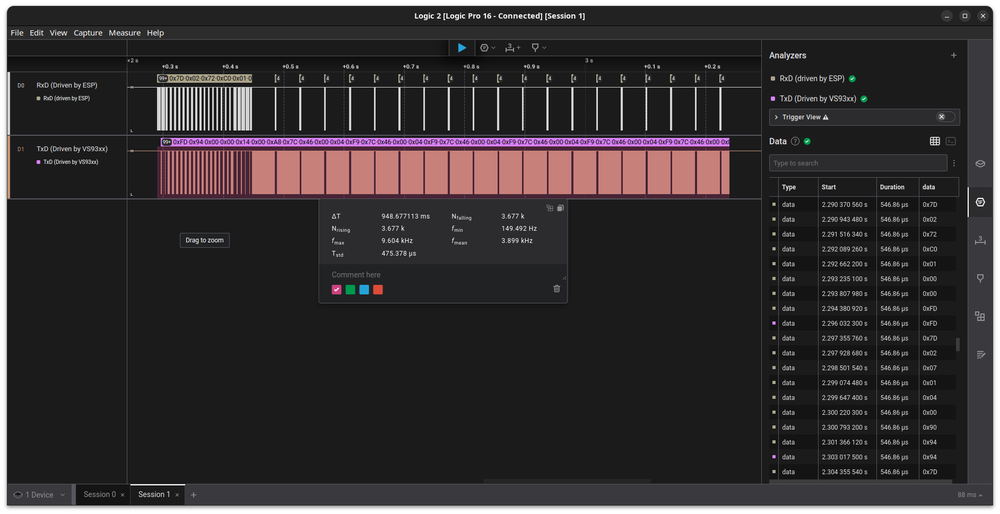

# V9360 UART Waveform Example

Demonstrates waveform buffer capture using the V9360 ASIC over UART.

## Features

- ✅ Uses `CaptureWaveform()` API for simplified capture
- ✅ Configures DSP for manual trigger mode
- ✅ Captures 512-sample waveform buffer
- ✅ Prints samples as 16-bit pairs for offline analysis
- ✅ Automatic overflow prevention

## Workflow

1. **Configure DSP_CTRL5**: Set channel, trigger mode, sample length
2. **Initiate Manual Capture**: Call `CaptureWaveform()`
3. **Download Data**: API reads from DAT_WAVE register
4. **Print Results**: Output as hex pairs for Python plotting

## Sample Output

```
V9360 UART Waveform Capture
Capturing waveform...
Capture successful! 309 words

Waveform Data (309 samples):
Sample 0000: [0x1234,0x5678]
Sample 0001: [0xABCD,0xEF01]
...
```

## Visualization

A test signal was applied to the UP/UN inputs:



Using the Python helper script, captured data is reconstructed:



**Plot your own data:**
```bash
python tools/plot_v9360_waveform.py
```

The script performs:
- Time-domain waveform plotting
- FFT analysis with frequency spectrum
- Peak detection

## Performance

UART capture timing at 19200 baud:
- **Configuration + DSP Capture**: ~150ms
- **Data Download (309 words)**: ~795ms
- **Total**: ~945ms per capture cycle

Using V93XX block read features for efficiency:



## API Usage

This example demonstrates the `CaptureWaveform()` API:

```cpp
const uint32_t ctrl5 = (1 << 18) | (2 << 9) | (0 << 6);
uint32_t waveform[512];

if (v9360.CaptureWaveform(waveform, 512, ctrl5)) {
    // Process samples...
}
```

For on-board FFT analysis, see [V9360_UART_FFT](../V9360_UART_FFT/).